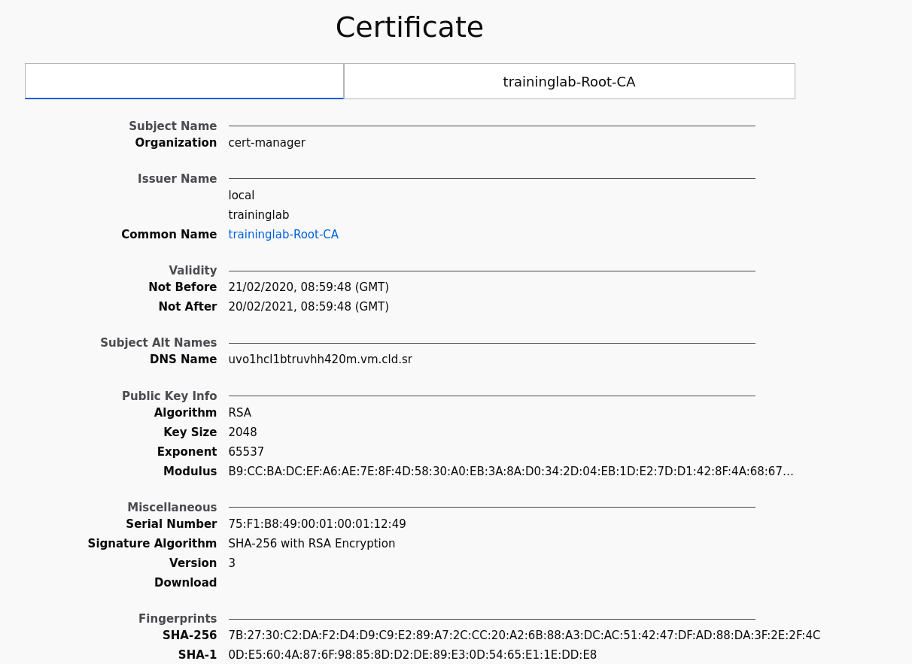
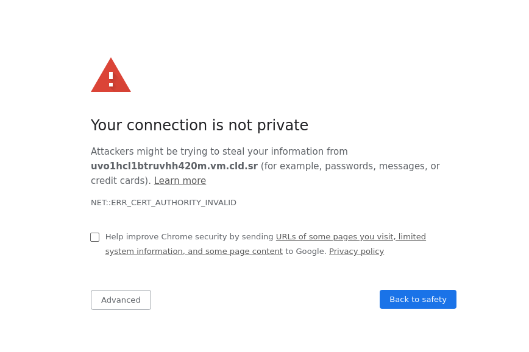
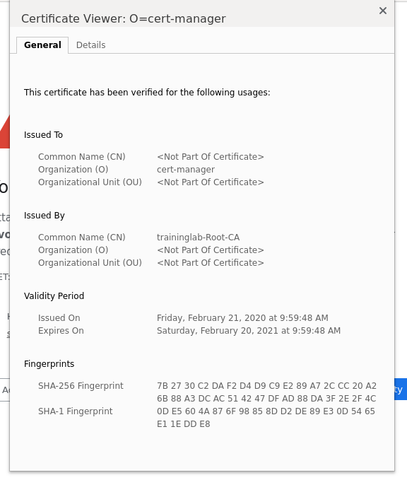
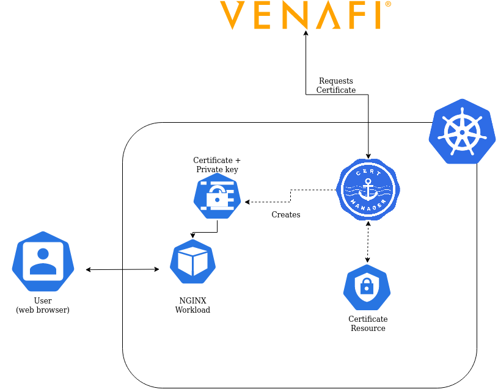

# Vanafi cert-manager lab

In this lab we will set up a Kubernetes cluster in our lab instance. In this Kubernetes cluster we will deploy a demo service which will then be secured using cert-manager.
cert-manager is Kubernetes addon for issuing and managing TLS certificates & application identities in a Kubernetes cluster, providing deep integration points with native Kubernetes features for managing network traffic.
cert-manager provides full Venafi integration.

## Glossary
* `Kubernetes`: an open-source container-orchestration system for automating application deployment, scaling, and management
* `kubectl`: a command-line utility used by developers to control a Kubernetes cluster
* `cert-manager`: a native Kubernetes certificate management controller.
* `Ingress`: an Ingress controller in Kubernetes sits on the edge and is responsible for routing incoming traffic
* `TLS Certificate`: a digital certificate to prove ownership of a given domain name used with encrypted connections
* `Certificate Authority`: an entity that issues digital certificates which are thereafter trusted


## Setup
We need to install Kubernetes on the machine first, as well as an ingress controller to forward any incoming web traffic.
Then we will install and configure cert-manager to work with Venafi Trust Protection Platform.

### Setting up cluster
This script will install kubectl and kind. 
Kubectl is used by developers and sysadmins to interact with the Kubernetes cluster from the command line. We will use it to configure all resources on the cluster as well as verifying the status of it.
Kind (Kubernetes in Docker) is what is used to create a development Kubernetes cluster which will run on a single machine for testing and development.
The cluster will be set up with port 80 and 443 exposed on the host network so we can access the services we're about to setup on this cluster from the public internet.
To start the setup run: 
```console
$ ./setup-k8s.sh
```

Once this is installed we can confirm the installation using `kubectl`:
```console
$ kubectl get nodes
NAME                 STATUS   ROLES    AGE   VERSION
kind-control-plane   Ready    master   72s   v1.17.0
```
Here we will see all nodes in our cluster, which in one case is just one. If you see `NotReady` under status that means not all services have been started yet. You might have to wait a little bit.

### Installing the NGINX Ingress
Now we are ready to configure our cluster to allow the services we deploy to be accessible from the open internet securely. 
The Ingress controller in Kubernetes sits on the edge and is responsible for routing external HTTP(s) traffic into the cluster to the correct service.
NGINX acts here as a reverse proxy server that forwards traffic to the internal services as well as handling TLS.
This lab gives you the option between using the open-source version of NGINX or the NGINX Plus. 


You can install the open source version of the NGINX ingress controller use:
```console
$ ./setup-nginx.sh
```
For NGINX Plus you can use the following:
First of all you need the `nginx-repo.crt` and `nginx-repo.key` files placed in the root of this repository.
Once they are there you can run:
```console
$ ./setup-nginx-plus.sh
```
This will build the NGINX Plus Docker image locally and upload it to the local cluster, this might take a while.
Once NGINX Plus is deployed you can access the dashboard on port `http://<hostname>:8080/dashboard.html` (The hostname can be found in your CloudShare environment under "Connection Details", then "External Address").

### Installing cert-manager
Next we're installing cert-manager. cert-manager will allow you to integrate the Venafi platforms with Kubernetes to issue TLS certificates and provide identity management for applications across your cluster
To install cert-manager run:
```console
$ ./setup-cert-manager.sh
```
This will install cert-manager in its default configuration inside the cluster.

## Issuing certificates

### Setting up Venafi TPP
To setup Venafi TPP with cert-manager we need to do two things:
* Configure the Venafi TPP credentials
* Configure cert-manager to talk to our Venafi TPP instance

First of all we need to create a new Kubernetes secret with the TPP credentials, these will be provided during the lab session:
```console
$ kubectl create secret generic \
       tpp-auth-secret \
       --namespace=default \
       --from-literal=username='YOUR_TPP_USERNAME_HERE' \
       --from-literal=password='YOUR_TPP_PASSWORD_HERE'
```
These are stored inside the Kubernetes cluster's secrets storage for the default [namespace](https://kubernetes.io/docs/concepts/overview/working-with-objects/namespaces/).

Now that we have our credentials set up we need to set up the [Issuer](https://cert-manager.io/docs/concepts/issuer/) for cert-manager.
Issuers are Kubernetes resources that represent an instance that is able to generate signed certificates by honoring certificate signing requests. In this example an instance of Venafi Trusted Protection Platform.

Open the `venafi-issuer.yaml` file. 
This can be done using `nano`, for example:
```console
$ nano venafi-issuer.yaml
```
This gives you an editor with the file, after making the changes do `Ctrl+O` to save the file, and then `Ctlr+X` to leave the editor.

Here we see the Issuer configuration.
Change the URL to the correct instance (this will be provided to you during the lab session), then save it.

```yaml
apiVersion: cert-manager.io/v1alpha2
kind: Issuer
metadata:
  name: venafi-tpp-issuer
  namespace: default
spec:
  venafi:
    zone: Kubernetes
    tpp:
      url: https://<instance>/vedsdk # Change this to the URL of your TPP instance
      credentialsRef:
        name: tpp-auth-secret
```

Now we can apply this configuration to the cluster using:
```console
$ kubectl apply -f venafi-issuer.yaml
```

Now this is set up and ready to go! 

### Securing an Ingress
To demonstrate a working ingress we built a sample "Hello World" service in `hello-world.yaml`.
In this file we have an Ingress entry. Ingresses can be automatically secured by cert-mananger using special annotations on the Ingress resource.

Open the `hello-world.yaml` file and change the host fields in the file to match the external hostname of your instance so we can test this from the outside world.
This can be found in your CloudShare environment under "Connection Details", then "External Address".

The `cert-manager.io/issuer` annotation tells cert-manager to install a TLS certificate received from the Issuer we installed earlier.
```yaml
apiVersion: extensions/v1beta1
kind: Ingress
metadata:
  name: hello-world
  namespace: default
  annotations:
    kubernetes.io/ingress.class: "nginx"
    cert-manager.io/issuer: "venafi-tpp-issuer"
spec:
  tls:
    - hosts:
        - <place external hostname here>
      secretName: venafi-demo-tls
  rules:
    - host: <place external hostname here>
    [...]
```

After changing and saving the file we can deploy it using `kubectl apply -f hello-world.yaml`

Now we have an Ingress deployed with a `cert-manager.io/issuer` annotation, this will tell cert-manager to use a specific issuer to automatically fetch and assign a certificate according to the policy you have configured on your Issuer resource.
We can see them being issued using:
```console
$ kubectl get certificate
NAME              READY   SECRET            AGE
venafi-demo-tls   True    venafi-demo-tls   1m
```
The private key and certificate have been saved into `venafi-demo-tls` inside the Kubernetes secret store from where NGINX picks it up.
The NGINX Ingress controller has native support for reading TLS secrets from Kubernetes.

### Testing the deployment

#### Using curl
You can see it being served using:
```console
$ curl https://<hostname> -k -v
[...]
* SSL connection using TLSv1.2 / ECDHE-RSA-AES256-GCM-SHA384
* ALPN, server accepted to use http/1.1
* Server certificate:
*  subject: O=cert-manager
*  start date: Feb 20 14:51:12 2020 GMT
*  expire date: Feb 19 14:51:12 2021 GMT
*  issuer: DC=local; DC=traininglab; CN=traininglab-Root-CA
*  SSL certificate verify result: self signed certificate in certificate chain (19), continuing anyway.
```
Notice that the issue in this example is being signed by a training Venafi TPP instance which is not a trusted certificate authority.

#### Using Firefox

Open your browser and browse to the hostname of your instance.
You will see an "insecure" warning, this is because for this lab we used a training certificate authority which is not trusted by our computer.

Click on "Advanced" and then to "View Certificate", here you can see the info about the certificate which we just issued.

If you click "Accept the risk and continue" you will be presented with our "Hello World" service.


#### Using Chrome
Open your browser and browse to the hostname of your instance.
You will see an "insecure" warning, this is because for this lab we used a training certificate authority which is not trusted by our computer.

Type "this is unsafe" on your keyboard (don't worry you won't see any letters appear), this will bypass the warning screen and you will be presented with our "Hello World" service.
In the top bar click on "Not Secure" then click on "Certificate", here you can see the info about the certificate which we just issued.



### Securing Workload
cert-manager cannot only be used to secure incoming traffic to your Kubernetes cluster but also to manage certificates for workloads on the cluster.
In this example we have an NGINX Plus server running with a port exposed. This service is secured using a Venafi issued certificate.


This is a diagram of what we're building in this part of the lab.

First of all we have to build the NGINX Plus Docker image using:
```console
$ ./setup-docker-nginx-plus.sh
```

The deployment of this workload is in `workload.yaml`. The important part here is teh Certificate resource. This resource will tell cert-manager to request a Certificate from the Venafi TPP instance we configured earlier.
In this case we request a certificate for `workload.demo.example.com` that is valid for 90 days.
```yaml
---
apiVersion: cert-manager.io/v1alpha2
kind: Certificate
metadata:
  name: workload
  namespace: default
spec:
  secretName: workload-tls
  duration: 2160h # 90d
  dnsNames:
    - workload.demo.example.com
  issuerRef:
    name: venafi-tpp-issuer
    kind: Issuer
```

We can apply this configuration to the cluster using:
```console
$ kubectl apply -f workload.yaml
```

Once deployed we can see our workload running:
```console
$ kubectl get pods
sysadmin@C6274862831:~$ kubectl get pods
NAME                              READY   STATUS    RESTARTS   AGE
nginx-workload-7d5fbb6f48-dz2wb   1/1     Running   0          1m
```
We can also see the certificate:
```console
$ kubectl get certificates
NAME              READY   SECRET            AGE
workload          True    workload-tls      1m
```

We see the `workload` certificate being ready and stored as `workload-tls` inside the Kubernetes secret store.
This secret is then attached to the container for NGINX to pick up the certificate and private key.

### Testing the deployment

#### Using curl
The workload is exposed on the server on port `4430`
You can see it being served using:
```console
$ curl https://localhost:4430 -k -v
[...]
* SSL connection using TLSv1.2 / ECDHE-RSA-AES256-GCM-SHA384
* ALPN, server accepted to use http/1.1
* Server certificate:
*  subject: O=cert-manager
*  start date: Feb 20 14:51:12 2020 GMT
*  expire date: Feb 19 14:51:12 2021 GMT
*  issuer: DC=local; DC=traininglab; CN=traininglab-Root-CA
*  SSL certificate verify result: self signed certificate in certificate chain (19), continuing anyway.
```

Notice that the issue in this example is being signed by a training Venafi TPP instance which is not a trusted certificate authority.
